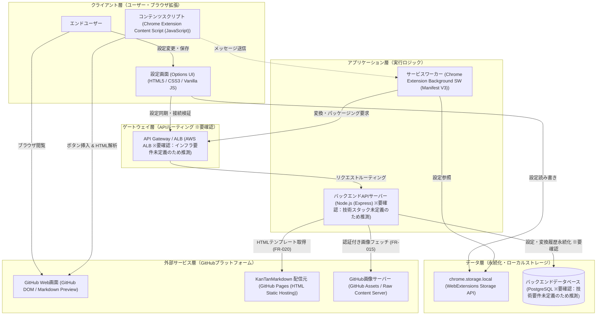

# アーキテクチャ構成図

ブラウザ拡張機能（Manifest V3）とバックエンドAPIサーバー（API仕様書に基づく構成 ※要確認：システム概要に記載の完全クライアントサイド動作モデルとの不整合について要確認）が連携するハイブリッド型アーキテクチャ

**クライアント層（ユーザー・ブラウザ拡張）:**
- エンドユーザー
- コンテンツスクリプト [Chrome Extension Content Script (JavaScript)]
- 設定画面 (Options UI) [HTML5 / CSS3 / Vanilla JS]

**ゲートウェイ層（APIルーティング ※要確認）:**
- API Gateway / ALB [AWS ALB ※要確認：インフラ要件未定義のため推測]

**アプリケーション層（実行ロジック）:**
- サービスワーカー [Chrome Extension Background SW (Manifest V3)]
- バックエンドAPIサーバー [Node.js (Express) ※要確認：技術スタック未定義のため推測]

**データ層（永続化・ローカルストレージ）:**
- chrome.storage.local [WebExtensions Storage API]
- バックエンドデータベース [PostgreSQL ※要確認：技術要件未定義のため推測]

**外部サービス層（GitHubプラットフォーム）:**
- GitHub Web画面 [GitHub DOM / Markdown Preview]
- KanTanMarkdown 配信元 [GitHub Pages (HTML Static Hosting)]
- GitHub画像サーバー [GitHub Assets / Raw Content Server]

**接続:**
- エンドユーザー → GitHub Web画面 (HTTPS)
- エンドユーザー → 設定画面 (Options UI) (UI)
- コンテンツスクリプト → GitHub Web画面 (DOM API)
- コンテンツスクリプト → サービスワーカー (Message Passing)
- 設定画面 (Options UI) → chrome.storage.local (chrome.storage API)
- 設定画面 (Options UI) → API Gateway / ALB (HTTPS)
- サービスワーカー → chrome.storage.local (chrome.storage API)
- サービスワーカー → API Gateway / ALB (HTTPS)
- API Gateway / ALB → バックエンドAPIサーバー (HTTP)
- バックエンドAPIサーバー → バックエンドデータベース (SQL)
- バックエンドAPIサーバー → KanTanMarkdown 配信元 (HTTPS)
- バックエンドAPIサーバー → GitHub画像サーバー (HTTPS)

