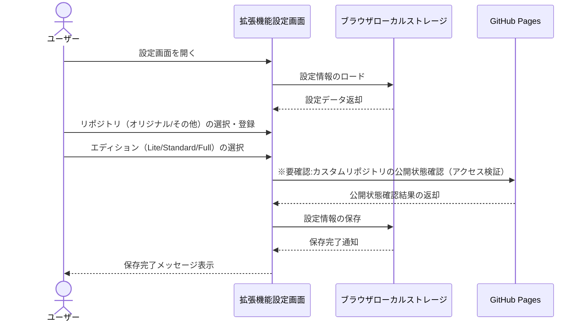
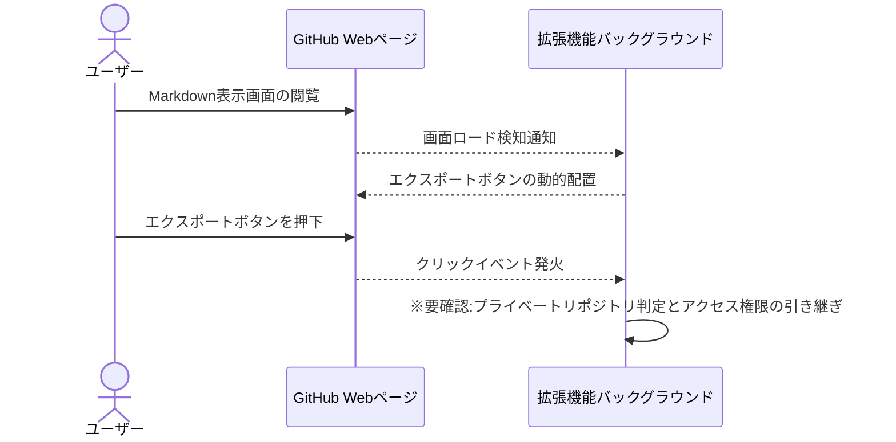
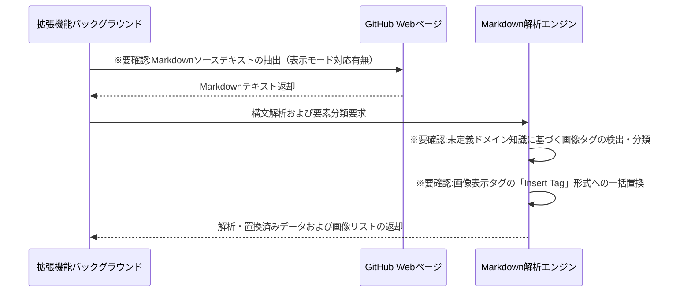
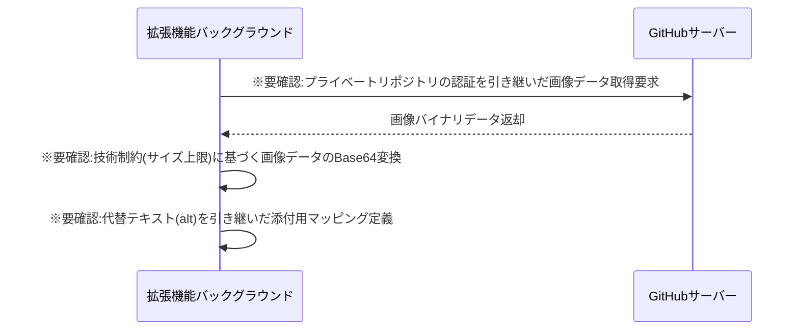
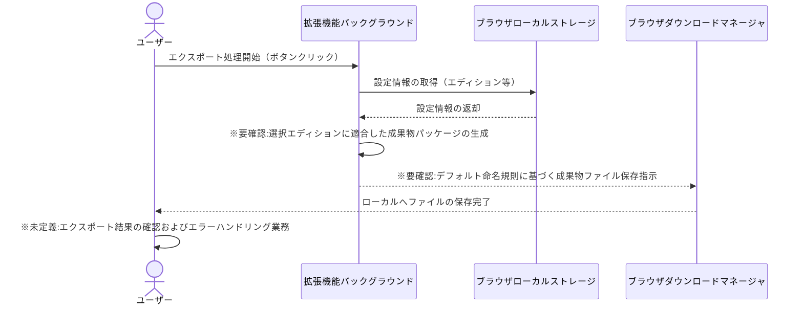

# 業務フロー

## 設定管理

ユーザーが拡張機能の動作環境を設定し、かんたんMarkdownの接続先リポジトリやエディションを選択・保存するフロー

**参加者:** ユーザー (actor)、拡張機能設定画面 (system)、ブラウザローカルストレージ (database)、GitHub Pages (external)

**メッセージフロー:**
- ユーザー → 拡張機能設定画面: 設定画面を開く
- 拡張機能設定画面 → ブラウザローカルストレージ: 設定情報のロード
  - ブラウザローカルストレージ ← 拡張機能設定画面: 設定データ返却
- ユーザー → 拡張機能設定画面: リポジトリ（オリジナル/その他）の選択・登録
- ユーザー → 拡張機能設定画面: エディション（Lite/Standard/Full）の選択
- 拡張機能設定画面 → GitHub Pages: ※要確認:カスタムリポジトリの公開状態確認（アクセス検証）
  - GitHub Pages ← 拡張機能設定画面: 公開状態確認結果の返却
- 拡張機能設定画面 → ブラウザローカルストレージ: 設定情報の保存
  - ブラウザローカルストレージ ← 拡張機能設定画面: 保存完了通知
  - 拡張機能設定画面 ← ユーザー: 保存完了メッセージ表示

## GitHub UI統合・制御

GitHub上のMarkdownプレビュー画面を自動検知し、エクスポート用のボタンを動的に配置・制御するフロー

**参加者:** ユーザー (actor)、GitHub Webページ (external)、拡張機能バックグラウンド (system)

**メッセージフロー:**
- ユーザー → GitHub Webページ: Markdown表示画面の閲覧
- GitHub Webページ → 拡張機能バックグラウンド: 画面ロード検知通知
- 拡張機能バックグラウンド → GitHub Webページ: エクスポートボタンの動的配置
- ユーザー → GitHub Webページ: エクスポートボタンを押下
- GitHub Webページ → 拡張機能バックグラウンド: クリックイベント発火
- 拡張機能バックグラウンド → 拡張機能バックグラウンド: ※要確認:プライベートリポジトリ判定とアクセス権限の引き継ぎ

## Markdown解析・変換

GitHubから抽出したMarkdownテキストを解析し、独自のタグ置換およびかんたんMarkdown用フォーマットへ構成するフロー

**参加者:** 拡張機能バックグラウンド (system)、GitHub Webページ (external)、Markdown解析エンジン (system)

**メッセージフロー:**
- 拡張機能バックグラウンド → GitHub Webページ: ※要確認:Markdownソーステキストの抽出（表示モード対応有無）
  - GitHub Webページ ← 拡張機能バックグラウンド: Markdownテキスト返却
- 拡張機能バックグラウンド → Markdown解析エンジン: 構文解析および要素分類要求
- Markdown解析エンジン → Markdown解析エンジン: ※要確認:未定義ドメイン知識に基づく画像タグの検出・分類
- Markdown解析エンジン → Markdown解析エンジン: ※要確認:画像表示タグの「Insert Tag」形式への一括置換
  - Markdown解析エンジン ← 拡張機能バックグラウンド: 解析・置換済みデータおよび画像リストの返却

## 画像データ制御

Markdown内の画像URLをフェッチし、認証状態を引き継ぎながら「かんたんMarkdown」用の添付データへ変換するフロー

**参加者:** 拡張機能バックグラウンド (system)、GitHubサーバー (external)

**メッセージフロー:**
- 拡張機能バックグラウンド → GitHubサーバー: ※要確認:プライベートリポジトリの認証を引き継いだ画像データ取得要求
  - GitHubサーバー ← 拡張機能バックグラウンド: 画像バイナリデータ返却
- 拡張機能バックグラウンド → 拡張機能バックグラウンド: ※要確認:技術制約(サイズ上限)に基づく画像データのBase64変換
- 拡張機能バックグラウンド → 拡張機能バックグラウンド: ※要確認:代替テキスト(alt)を引き継いだ添付用マッピング定義

## エクスポート・ファイル出力

収集された変換データから成果物をパッケージングし、ローカル環境へファイルをダウンロード出力する一連のフロー

**参加者:** ユーザー (actor)、拡張機能バックグラウンド (system)、ブラウザローカルストレージ (database)、ブラウザダウンロードマネージャ (system)

**メッセージフロー:**
- ユーザー → 拡張機能バックグラウンド: エクスポート処理開始（ボタンクリック）
- 拡張機能バックグラウンド → ブラウザローカルストレージ: 設定情報の取得（エディション等）
  - ブラウザローカルストレージ ← 拡張機能バックグラウンド: 設定情報の返却
- 拡張機能バックグラウンド → 拡張機能バックグラウンド: ※要確認:選択エディションに適合した成果物パッケージの生成
- 拡張機能バックグラウンド → ブラウザダウンロードマネージャ: ※要確認:デフォルト命名規則に基づく成果物ファイル保存指示
  - ブラウザダウンロードマネージャ ← ユーザー: ローカルへファイルの保存完了
- ユーザー → ユーザー: ※未定義:エクスポート結果の確認およびエラーハンドリング業務

