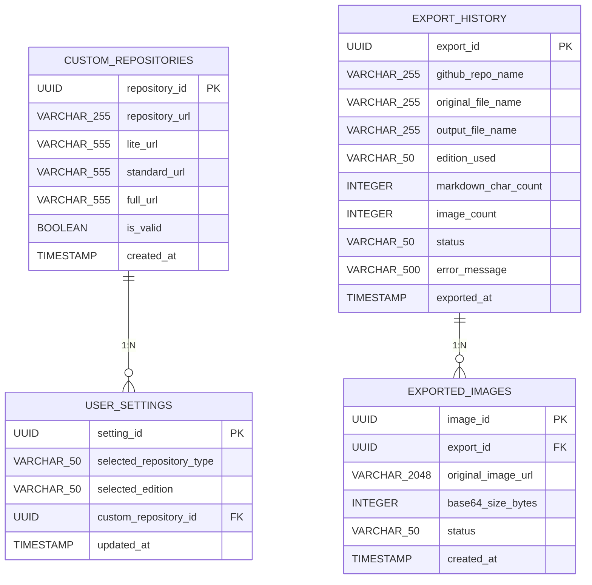

# ER図

GitHub Markdownから「かんたんMarkdown」へのエクスポート機能および接続リポジトリ設定を管理するER図。※議事録やビジネスルール等のコンテキスト未提供のため、エディションURL自動生成仕様や画像容量制限監視、処理ステータスの管理設計は仮設定として推測補完（※要確認）。なお、マルチユーザー管理や認証仕様に関する情報は不足しているため、現在は『未定義』としています。

### エンティティ一覧

**USER_SETTINGS**

| カラム名 | データ型 | キー |
| --- | --- | --- |
| setting_id | UUID | PK |
| selected_repository_type | VARCHAR(50) |  |
| selected_edition | VARCHAR(50) |  |
| custom_repository_id | UUID | FK |
| updated_at | TIMESTAMP |  |

**CUSTOM_REPOSITORIES**

| カラム名 | データ型 | キー |
| --- | --- | --- |
| repository_id | UUID | PK |
| repository_url | VARCHAR(255) |  |
| lite_url | VARCHAR(555) |  |
| standard_url | VARCHAR(555) |  |
| full_url | VARCHAR(555) |  |
| is_valid | BOOLEAN |  |
| created_at | TIMESTAMP |  |

**EXPORT_HISTORY**

| カラム名 | データ型 | キー |
| --- | --- | --- |
| export_id | UUID | PK |
| github_repo_name | VARCHAR(255) |  |
| original_file_name | VARCHAR(255) |  |
| output_file_name | VARCHAR(255) |  |
| edition_used | VARCHAR(50) |  |
| markdown_char_count | INTEGER |  |
| image_count | INTEGER |  |
| status | VARCHAR(50) |  |
| error_message | VARCHAR(500) |  |
| exported_at | TIMESTAMP |  |

**EXPORTED_IMAGES**

| カラム名 | データ型 | キー |
| --- | --- | --- |
| image_id | UUID | PK |
| export_id | UUID | FK |
| original_image_url | VARCHAR(2048) |  |
| base64_size_bytes | INTEGER |  |
| status | VARCHAR(50) |  |
| created_at | TIMESTAMP |  |

### リレーション

- CUSTOM_REPOSITORIES → USER_SETTINGS (1:N)
- EXPORT_HISTORY → EXPORTED_IMAGES (1:N)

### ER図

