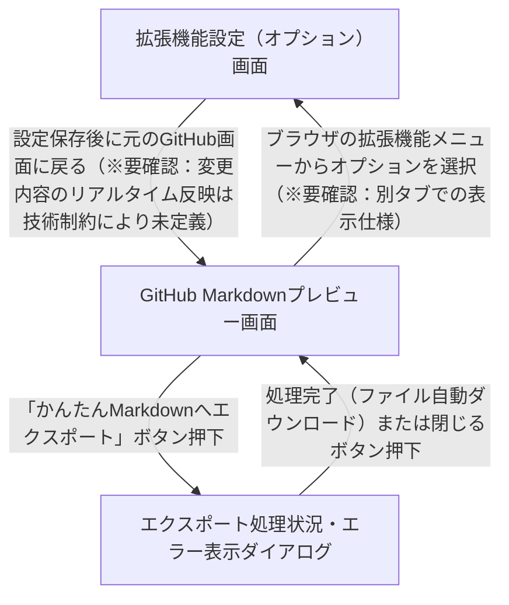

# 画面遷移

本画面遷移図は、GitHub Markdownプレビュー画面から「かんたんMarkdown」形式への変換・エクスポートを行う拡張機能の画面遷移を表しています。GitHub上へのボタンインジェクション時の動的DOM監視や、プライベートリポジトリ接続時のOAuth認可画面など（ドメイン知識および技術要件）は「未定義」のため、主要な3画面を中心に遷移を定義しています。また、設定変更後の即時反映処理については「※要確認」として暫定で定義しています。

**フロー:**
- GitHub Markdownプレビュー画面 → エクスポート処理状況・エラー表示ダイアログ (「かんたんMarkdownへエクスポート」ボタン押下)
- エクスポート処理状況・エラー表示ダイアログ → GitHub Markdownプレビュー画面 (処理完了（ファイル自動ダウンロード）または閉じるボタン押下)
- GitHub Markdownプレビュー画面 → 拡張機能設定（オプション）画面 (ブラウザの拡張機能メニューからオプションを選択（※要確認：別タブでの表示仕様）)
- 拡張機能設定（オプション）画面 → GitHub Markdownプレビュー画面 (設定保存後に元のGitHub画面に戻る（※要確認：変更内容のリアルタイム反映は技術制約により未定義）)

