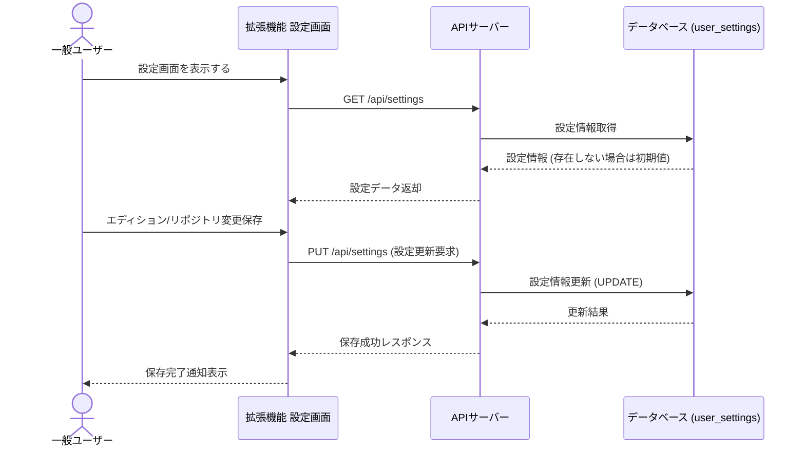
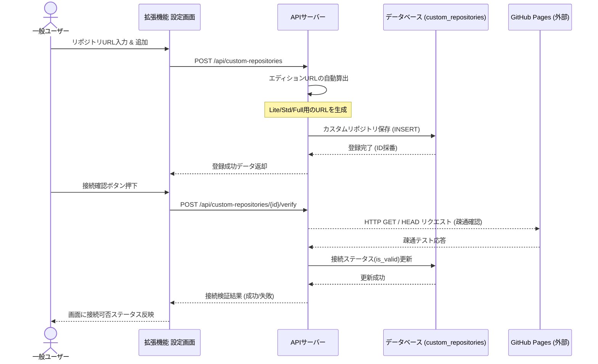
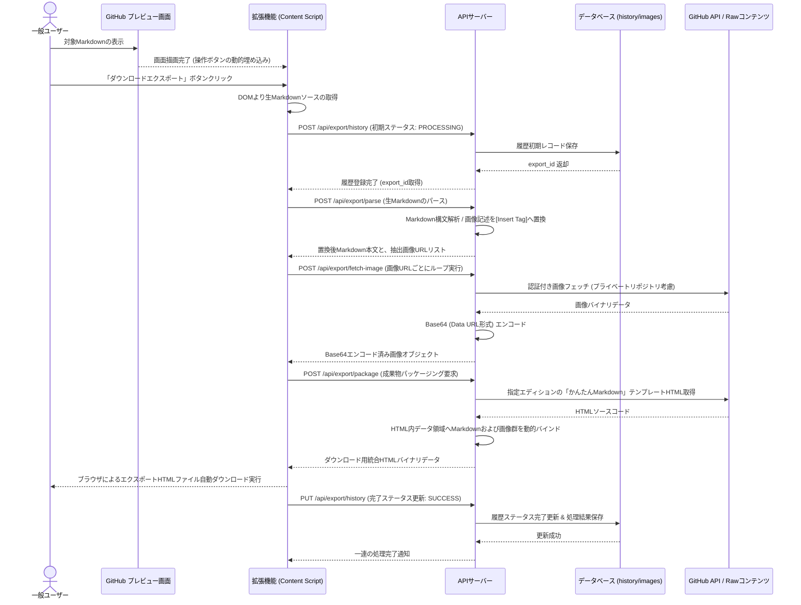
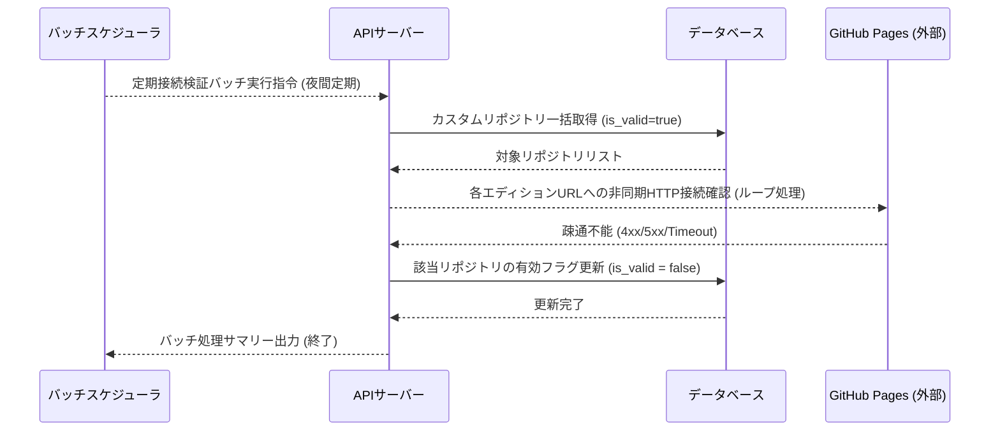

# シーケンス図

## ユーザー設定管理

ユーザーごとの拡張機能設定（エディション、リポジトリ区分など）をバックエンドと同期して永続化管理するフロー。※要確認（拡張機能のローカルストレージのみで完結させる場合は不要だが、本システムではアカウント間同期を想定してDB連携として設計）

**参加者:** 一般ユーザー (actor)、拡張機能 設定画面 (system)、APIサーバー (system)、データベース (user_settings) (database)

**メッセージフロー:**
- 一般ユーザー → 拡張機能 設定画面: 設定画面を表示する
- 拡張機能 設定画面 → APIサーバー: GET /api/settings
- APIサーバー → データベース (user_settings): 設定情報取得
  - データベース (user_settings) ← APIサーバー: 設定情報 (存在しない場合は初期値)
  - APIサーバー ← 拡張機能 設定画面: 設定データ返却
- 一般ユーザー → 拡張機能 設定画面: エディション/リポジトリ変更保存
- 拡張機能 設定画面 → APIサーバー: PUT /api/settings (設定更新要求)
- APIサーバー → データベース (user_settings): 設定情報更新 (UPDATE)
  - データベース (user_settings) ← APIサーバー: 更新結果
  - APIサーバー ← 拡張機能 設定画面: 保存成功レスポンス
  - 拡張機能 設定画面 ← 一般ユーザー: 保存完了通知表示

## カスタムリポジトリ管理

ユーザー独自の「かんたんMarkdown」ホスティング用カスタムリポジトリの登録を行い、かつ実際にアクセス可能か自動検証を行うフロー。※要確認（検証の成否をDBに保存し、不正なリポジトリの誤登録を防止）

**参加者:** 一般ユーザー (actor)、拡張機能 設定画面 (system)、APIサーバー (system)、データベース (custom_repositories) (database)、GitHub Pages (外部) (external)

**メッセージフロー:**
- 一般ユーザー → 拡張機能 設定画面: リポジトリURL入力 & 追加
- 拡張機能 設定画面 → APIサーバー: POST /api/custom-repositories
- APIサーバー → APIサーバー: エディションURLの自動算出
- APIサーバー → データベース (custom_repositories): カスタムリポジトリ保存 (INSERT)
  - データベース (custom_repositories) ← APIサーバー: 登録完了 (ID採番)
  - APIサーバー ← 拡張機能 設定画面: 登録成功データ返却
- 一般ユーザー → 拡張機能 設定画面: 接続確認ボタン押下
- 拡張機能 設定画面 → APIサーバー: POST /api/custom-repositories/{id}/verify
- APIサーバー → GitHub Pages (外部): HTTP GET / HEAD リクエスト (疎通確認)
- GitHub Pages (外部) → APIサーバー: 疎通テスト応答
- APIサーバー → データベース (custom_repositories): 接続ステータス(is_valid)更新
  - データベース (custom_repositories) ← APIサーバー: 更新成功
  - APIサーバー ← 拡張機能 設定画面: 接続検証結果 (成功/失敗)
  - 拡張機能 設定画面 ← 一般ユーザー: 画面に接続可否ステータス反映

## エクスポート処理

GitHub上に表示されているMarkdownファイルおよびその添付画像を抽出し、Base64への変換を経て「かんたんMarkdown」HTMLに動的パッケージングしてダウンロードするメインコアプロセス。※要確認（プライベートリポジトリの画像アクセスのため、GitHubセッション連携APIを経由して安全に画像をフェッチ）

**参加者:** 一般ユーザー (actor)、GitHub プレビュー画面 (external)、拡張機能 (Content Script) (system)、APIサーバー (system)、データベース (history/images) (database)、GitHub API / Rawコンテンツ (external)

**メッセージフロー:**
- 一般ユーザー → GitHub プレビュー画面: 対象Markdownの表示
  - GitHub プレビュー画面 ← 拡張機能 (Content Script): 画面描画完了 (操作ボタンの動的埋め込み)
- 一般ユーザー → 拡張機能 (Content Script): 「ダウンロードエクスポート」ボタンクリック
- 拡張機能 (Content Script) → 拡張機能 (Content Script): DOMより生Markdownソースの取得
- 拡張機能 (Content Script) → APIサーバー: POST /api/export/history (初期ステータス: PROCESSING)
- APIサーバー → データベース (history/images): 履歴初期レコード保存
  - データベース (history/images) ← APIサーバー: export_id 返却
  - APIサーバー ← 拡張機能 (Content Script): 履歴登録完了 (export_id取得)
- 拡張機能 (Content Script) → APIサーバー: POST /api/export/parse (生Markdownのパース)
- APIサーバー → APIサーバー: Markdown構文解析 / 画像記述を[Insert Tag]へ置換
  - APIサーバー ← 拡張機能 (Content Script): 置換後Markdown本文と、抽出画像URLリスト
- 拡張機能 (Content Script) → APIサーバー: POST /api/export/fetch-image (画像URLごとにループ実行)
- APIサーバー → GitHub API / Rawコンテンツ: 認証付き画像フェッチ (プライベートリポジトリ考慮)
  - GitHub API / Rawコンテンツ ← APIサーバー: 画像バイナリデータ
- APIサーバー → APIサーバー: Base64 (Data URL形式) エンコード
  - APIサーバー ← 拡張機能 (Content Script): Base64エンコード済み画像オブジェクト
- 拡張機能 (Content Script) → APIサーバー: POST /api/export/package (成果物パッケージング要求)
- APIサーバー → GitHub API / Rawコンテンツ: 指定エディションの「かんたんMarkdown」テンプレートHTML取得
  - GitHub API / Rawコンテンツ ← APIサーバー: HTMLソースコード
- APIサーバー → APIサーバー: HTML内データ領域へMarkdownおよび画像群を動的バインド
  - APIサーバー ← 拡張機能 (Content Script): ダウンロード用統合HTMLバイナリデータ
  - 拡張機能 (Content Script) ← 一般ユーザー: ブラウザによるエクスポートHTMLファイル自動ダウンロード実行
- 拡張機能 (Content Script) → APIサーバー: PUT /api/export/history (完了ステータス更新: SUCCESS)
- APIサーバー → データベース (history/images): 履歴ステータス完了更新 & 処理結果保存
  - データベース (history/images) ← APIサーバー: 更新成功
  - APIサーバー ← 拡張機能 (Content Script): 一連の処理完了通知

## システム保守

システム管理者またはバッチスケジューラにより、登録されているすべてのカスタムリポジトリの疎通状態を定期チェック・更新するバッチフロー。※要確認（システム内部実行のため認証は省略）

**参加者:** バッチスケジューラ (system)、APIサーバー (system)、データベース (database)、GitHub Pages (外部) (external)

**メッセージフロー:**
- バッチスケジューラ → APIサーバー: 定期接続検証バッチ実行指令 (夜間定期)
- APIサーバー → データベース: カスタムリポジトリ一括取得 (is_valid=true)
  - データベース ← APIサーバー: 対象リポジトリリスト
- APIサーバー → GitHub Pages (外部): 各エディションURLへの非同期HTTP接続確認 (ループ処理)
- GitHub Pages (外部) → APIサーバー: 疎通不能 (4xx/5xx/Timeout)
- APIサーバー → データベース: 該当リポジトリの有効フラグ更新 (is_valid = false)
  - データベース ← APIサーバー: 更新完了
  - APIサーバー ← バッチスケジューラ: バッチ処理サマリー出力 (終了)

